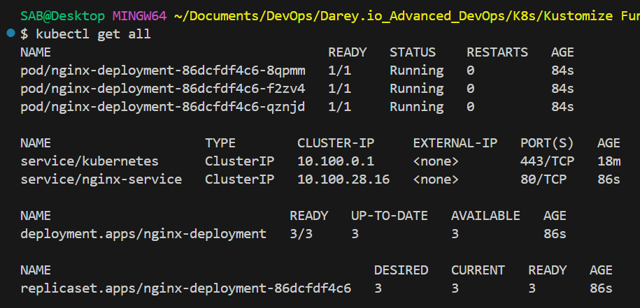

# Introduction to Configuration Management in Kubernetes with Kustomize on AWS

> A step-by-step guide for beginners to learn Kustomize (structure, customization, and overlays) and deploy those configurations to Amazon EKS.

---

## Table of Contents

1. Project overview
2. Prerequisites
3. Project directory structure
4. Lesson 2.1 — Kustomize structure & concepts (tasks + how-to)
5. Lesson 2.2 — Creating & managing resources (tasks + how-to)
6. Lesson 2.3 — Basic customization techniques (tasks + how-to)
7. Leveraging AWS — Deploying to Amazon EKS (step-by-step)
8. Verification & troubleshooting
9. Cleanup
10. Tips, best practices & further reading

---

## 1. Project overview

This project teaches the basics of configuration management in Kubernetes using **Kustomize**, and how to apply these concepts on **AWS** using **Amazon EKS**. Each lesson contains a short objective, explicit tasks, and step-by-step execution instructions so you can follow along and practice.

---

## 2. Prerequisites

Before you begin, install and configure the following on your local machine:

* `kubectl` (compatible with your Kubernetes cluster version)
* `kustomize` (or use the built-in kustomize in `kubectl apply -k`)
* `aws` CLI (configured via `aws configure`)
* `eksctl` (for creating and deleting EKS clusters)
* Docker CLI (optional; helpful for building images locally)

Confirm installation:

```bash
kubectl version --client
kustomize version   # optional
aws --version
eksctl version
```

---

## 3. Project directory structure

Create the following directory layout for the exercises:

```
myapp/
├── base/
│   ├── deployment.yaml
│   └── kustomization.yaml
└── overlays/
    ├── dev/
    │   ├── kustomization.yaml
    │   └── replica_count.yaml
    └── prod/
        └── kustomization.yaml
```

Create `myapp/` and the subdirectories now (example commands):

```bash
mkdir -p myapp/base myapp/overlays/dev myapp/overlays/prod
cd myapp
```

---

## 4. Lesson 2.1 — Kustomize structure & concepts

### Objective

Understand Kustomize directory layout, the `kustomization.yaml` file, and the difference between bases, overlays, and resources.

### Tasks

1. Create the base directory and add resources (Deployment YAML).
2. Create overlay directories `dev` and `prod`.
3. Create minimal `kustomization.yaml` files that reference the appropriate resources.

### Step-by-step execution

1. In `myapp/base/deployment.yaml` create a simple Deployment (example in Lesson 2.2 below).
2. Create `myapp/base/kustomization.yaml` with:

```yaml
resources:
  - deployment.yaml
```

3. Create `myapp/overlays/dev/kustomization.yaml` and `myapp/overlays/prod/kustomization.yaml` (they will reference the base in later lessons):

```yaml
# overlays/dev/kustomization.yaml (initially)
bases:
  - ../../base
```

> Note: Recent kustomize versions prefer `resources:` referencing a directory or file — `bases:` is an older field but still widely used in examples. You can also use:
>
> ```yaml
> resources:
>   - ../../base
> ```

---

## 5. Lesson 2.2 — Creating and managing resources

### Objective

Define resources (Deployment, Service, ConfigMap) in the base and learn how to include them in `kustomization.yaml`.

### Tasks

1. Add a basic Deployment manifest to `base/deployment.yaml`.
2. Reference the deployment from `base/kustomization.yaml`.
3. (Optional) Create a Service in the base and add it to `kustomization.yaml`.

### Step-by-step execution

1. Create `myapp/base/deployment.yaml` with this manifest:

```yaml
apiVersion: apps/v1
kind: Deployment
metadata:
  name: nginx-deployment
spec:
  replicas: 2
  selector:
    matchLabels:
      app: nginx
  template:
    metadata:
      labels:
        app: nginx
    spec:
      containers:
        - name: nginx
          image: nginx:1.14.2
          ports:
            - containerPort: 80
```

2. Ensure `myapp/base/kustomization.yaml` contains:

```yaml
resources:
  - deployment.yaml
```

3. (Optional) Add a Service `myapp/base/service.yaml` so the Deployment is reachable within the cluster:

```yaml
apiVersion: v1
kind: Service
metadata:
  name: nginx-service
spec:
  selector:
    app: nginx
  ports:
    - protocol: TCP
      port: 80
      targetPort: 80
  type: ClusterIP
```

Then update `base/kustomization.yaml`:

```yaml
resources:
  - deployment.yaml
  - service.yaml
```

4. Test locally against a cluster (or kind/minikube):

```bash
# From myapp/ directory
kubectl apply -k base/
kubectl get all
```

---

## 6. Lesson 2.3 — Basic customization techniques

### Objective

Learn how to create environment-specific overlays and apply patches (strategic merge) to modify the base.

### Tasks

1. Create `overlays/dev` and `overlays/prod` kustomization files.
2. In `dev`, patch the Deployment to change `replicas` to 3.
3. Apply overlays to a cluster and verify changes.

### Step-by-step execution

1. Create `myapp/overlays/dev/kustomization.yaml`:

```yaml
resources:
- ../../base
apiVersion: kustomize.config.k8s.io/v1beta1
kind: Kustomization
patches:
- path: replica_count.yaml
```

2. Create `myapp/overlays/dev/replica_count.yaml`:

```yaml
apiVersion: apps/v1
kind: Deployment
metadata:
  name: nginx-deployment
spec:
  replicas: 3
```

3. (Optional) For `prod` you might keep the base replica count or increase it differently. Example `myapp/overlays/prod/kustomization.yaml`:

```yaml
resources:
  - ../../base
```

4. Apply the dev overlay:

```bash
kubectl apply -k overlays/dev/
kubectl get deployment nginx-deployment -o yaml
```

You should see `replicas: 3` in the deployment spec after applying the overlay.

### Variables & placeholders

Kustomize supports namePrefix, nameSuffix, configMapGenerator, secretGenerator, and variable substitution via `vars`. For more advanced templating, consult the official Kustomize docs.

---

## 7. Leveraging AWS — Deploying to Amazon EKS (step-by-step)

This section steps you through creating an EKS cluster and applying your Kustomize overlays.

> **Warning**: EKS resources (nodes, load balancers) may incur AWS charges. Delete resources when finished.

### Step 0 — Configure AWS CLI

```bash
aws configure
# Enter Access Key ID, Secret Key, default region (e.g., us-west-2), and default output (json)
```

### Step 1 — Create an EKS cluster with `eksctl`

```bash
eksctl create cluster \
  --name my-kustomize-cluster \
  --version 1.18 \
  --region us-west-2 \
  --nodegroup-name my-nodes \
  --node-type t2.medium \
  --nodes 3
```

This command will take several minutes to finish. When complete, `kubectl` should be configured to talk to the new cluster.

Confirm access:

```bash
kubectl get nodes
kubectl get svc
```




### Step 2 — Deploy Kustomize overlay to EKS

From the project root `myapp/` choose the overlay, then apply:

```bash
kubectl apply -k overlays/dev/
```

Verify resources:

```bash
kubectl get all
kubectl describe deployment nginx-deployment
```

If you added a Service of type `LoadBalancer`, wait for an external IP/hostname to be provisioned (this creates an ELB and may incur charges):

```bash
kubectl get svc --watch
```

### Step 3 — Troubleshooting

* If resources don’t appear, check the current context: `kubectl config current-context`.
* Use `kubectl describe <resource>` and `kubectl logs <pod>` to inspect issues.
* Ensure AWS IAM permissions for your user are sufficient for EKS operations.

---

## 8. Verification & troubleshooting

### Useful commands

```bash
kubectl get all
kubectl get deployments,svc,po -o wide
kubectl describe deployment nginx-deployment
kubectl logs <pod-name>
kubectl apply -k overlays/prod/  # to test production overlay
```

### Common issues

* **Wrong kubeconfig/context**: Switch context with `kubectl config use-context <context-name>`.
* **ImagePullBackOff**: Check image name and network/registry authentication.
* **Missing files in kustomization**: Ensure file paths in `resources:` are correct and relative to the kustomization file.

---

## 9. Cleanup

After testing, remove Kubernetes resources and delete the EKS cluster to avoid charges.

```bash
kubectl delete -k overlays/dev/  # delete dev resources
eksctl delete cluster --name my-kustomize-cluster
```

---

## 10. Tips, best practices & further reading

* Keep `base/` generic and put only environment-specific differences into `overlays/`.
* Use `kustomize edit add resource` or `kubectl kustomize` commands for local diffs and previews.
* Use `kustomize build overlays/dev | kubectl apply -f -` to preview generated YAML before applying.

**Further reading**

* Kustomize official docs: [https://kubectl.docs.kubernetes.io/references/kustomize/](https://kubectl.docs.kubernetes.io/references/kustomize/)
* Amazon EKS user guide: [https://docs.aws.amazon.com/eks/](https://docs.aws.amazon.com/eks/)


